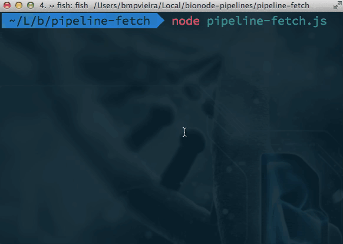
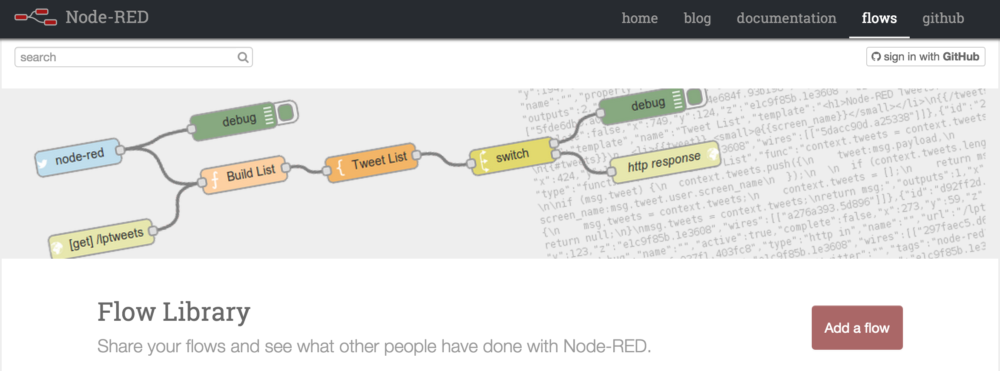
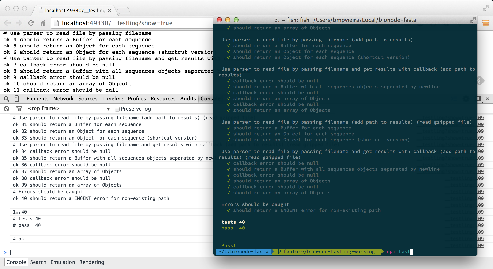
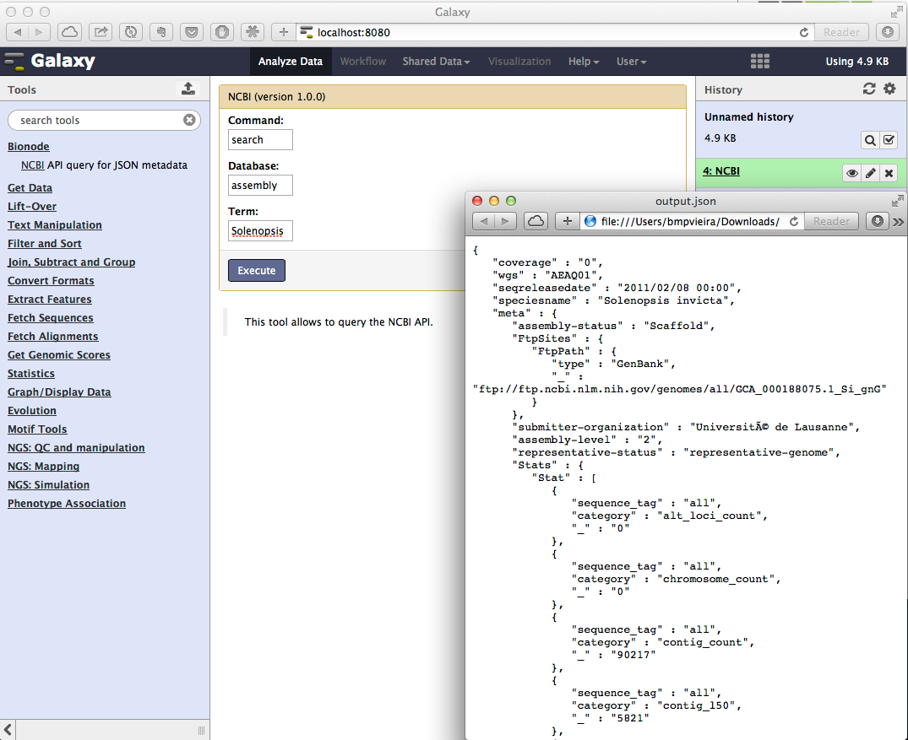

## Bionode Demo

<p style="float: left;"><a href="//bmpvieira.com/allbio14" target="_blank">bmpvieira.com/cw15</a></p>
<br>

<a href="http://bionode.io" target="_blank"></a>

---

### Some problems I faced during my research:

<ul>
<li class="fragment">For web projects, needed to implement the same functionality on browser and server</li>

<li class="fragment"> Difficulty getting relevant descriptions and datasets from NCBI API using bio\* libs</li>

<li class="fragment">Difficulty writing scalable, reproducible and complex bioinformatic pipelines</li>
</ul>

---

### Bionode

**[Bionode.io](http://bionode.io)** <span class="fragment" style="font-size: .8em;"> - *Modular and universal bioinformatics*</span>


<span class="fragment" style="font-size: .7em; line-height:10%;">Pipeable UNIX command line tools and JavaScript / Node.js APIs for bioinformatic analysis workflows on the server and browser.
<a class="fragment" href="http://irccloud.com/#!/ircs://irc.freenode.net:6697/%23bionode">#bionode</a>
<br>
<a class="fragment" href="http://gitter.im/bionode/bionode">gitter.im/bionode/bionode</a>

<div style="padding-bottom:1em;"></div>

---

### Collaborations and Reusability

<div class="" style="float: left; padding-right:2em; width:20%;">

<a href="http://dat-data.com" target="_blank">Dat-data.com</a>
</div>

<div class="" style="float: left; padding-right:2em; width:20%;">

<a href="http://biojs.net" target="_blank">BioJS.net</a>
</div>

* [Afra](http://afra.sbcs.qmul.ac.uk)
* [GeneValidator](http://genevalidator.sbcs.qmul.ac.uk)
* [SequenceServer](http://www.sequenceserver.com)
* [Biodalliance](http://www.biodalliance.org)
* [GeeFuTu](https://github.com/wookoouk/GeeFuTu)

---

** Difficulty getting relevant description and datasets from NCBI API using bio* libs **

<div class="fragment">
<p><strong>Python example:</strong> URL for the Acromyrmex assembly?</p>
<a href="ftp://ftp.ncbi.nlm.nih.gov/genomes/all/GCA_000188075.1_Si_gnG"><pre>ftp://ftp.ncbi.nlm.nih.gov/genomes/all/GCA_000188075.1_Si_gnG</pre></a>
</div>

<pre class="fragment">
<span class="fragment">import xml.etree.ElementTree as ET</span>
<span class="fragment">from Bio import Entrez</span>
<span class="fragment">Entrez.email = "mail@bmpvieira.com"</span>
<span class="fragment">esearch_handle = Entrez.esearch(db="assembly", term="Achromyrmex")</span>
<span class="fragment">esearch_record = Entrez.read(esearch_handle)</span>
<span class="fragment">for id in esearch_record['IdList']:</span>
<span class="fragment">  esummary_handle = Entrez.esummary(db="assembly", id=id)</span>
<span class="fragment">  esummary_record = Entrez.read(esummary_handle)</span>
<span class="fragment">  documentSummarySet = esummary_record['DocumentSummarySet']</span>
<span class="fragment">  document = documentSummarySet['DocumentSummary'][0]</span>
<span class="fragment">  metadata_XML = document['Meta'].encode('utf-8')</span>
<span class="fragment">  metadata = ET.fromstring('<root>' + metadata_XML + '</root>')</span>
<span class="fragment">  for entry in Metadata[1]:</span>
<span class="fragment">    print entry.text</span>
</pre>

<span class="fragment">
Solution: <a href="http://github.com/bionode/bionode-ncbi">bionode-ncbi</a>
</span>

---

** Better way with Bionode - 4 approaches **

<p class="fragment">JavaScript</p>
<pre class="fragment">
<span class="fragment">var bio = require('bionode')</span>
</pre>
<pre class="fragment">
<span class="fragment">//Callback pattern</span>
<span class="fragment">bio.ncbi.urls('assembly', 'Acromyrmex', function(urls) {</span>
<span class="fragment">  console.log(urls[0].genomic.fna)</span>
<span class="fragment">})</span>
</pre>

<pre class="fragment">
<span class="fragment">//Event pattern</span>
<span class="fragment">bio.ncbi.urls('assembly', 'Acromyrmex').on('data', printGenomeURL)</span>
<span class="fragment">function printGenomeURL(url) {</span>
<span class="fragment">  console.log(url.genomic.fna)</span>
<span class="fragment">}</span>
</pre>

<pre class="fragment">
<span class="fragment">//Pipe pattern</span>
<span class="fragment">var tool = require('tool-stream')</span>
<span class="fragment">bio.ncbi.urls('assembly', 'Acromyrmex')</span>
<span class="fragment">.pipe(tool.extractProperty('genomic.fna'))</span>
<span class="fragment">.pipe(process.stdout)</span>
</pre>

<p class="fragment">BASH</p>
<pre style="font-size:.5em;" class="fragment">
<span class="fragment">bionode ncbi urls assembly Acromyrmex | tool-stream extractProperty genomic.fna</span>
</pre>

---

**Complex pipelines with forks**

<pre>
<span class="">ncbi</span>
<span class="">.search('sra', 'Solenopsis invicta')</span>
<span class="">.pipe(fork1)</span>
<span class="">.pipe(dat.reads)</span>

<span class="">fork1</span>
<span class="">.pipe(tool.extractProperty('expxml.Biosample.id'))</span>
<span class="">.pipe(ncbi.search('biosample'))</span>
<span class="">.pipe(dat.samples)</span>

<span class="">fork1</span>
<span class="">.pipe(tool.extractProperty('uid'))</span>
<span class="">.pipe(ncbi.link('sra', 'pubmed'))</span>
<span class="">.pipe(ncbi.search('pubmed'))</span>
<span class="">.pipe(fork2)</span>
<span class="">.pipe(dat.papers)</span>
</pre>

---



---

<section data-background="img/noflo.png"><a href="http://noflojs.org">noflo</a></section>

---

<a href="http://nodered.org/" target="_blank"></a>

<div class="fragment">
<br>
Better pipeline representation format?
Search GitHub for
<ul>
<li>Gasket</li>
<li>Datscript</li>
<li>Hackfile</li>
</ul>
</div>

---

### Install Node.js and Bionode

```bash
 # Mac
  brew install n
  n stable
```

```bash
 # Ubuntu
  sudo apt-get install npm
  npm install -g n
  n stable
```

```bash
 # Windows
  Go to http://nodejs.org
```

#### Online
[try.bionode.io](http://try.bionode.io)  
[bit.ly/try-dat](http://bit.ly/try-dat)

#### Install bionode and json parser
```bash
npm install -g bionode-ncbi bionode-fasta json
```

---

<pre style="font-size:.65em;">
 bionode-ncbi search genome spiders
 bionode-ncbi search genome spiders | wc
 bionode-ncbi search genome spiders | head -n 1 | json
 bionode-ncbi search genome spiders | json -ga organism_name
</pre>

 <pre style="font-size:.65em;">
  bionode-ncbi search genome spiders | \
    json -ga uid | \
      bionode-ncbi link genome pubmed - | \
        json -ga destUID | \
          bionode-ncbi search pubmed - | \
            json -ga title
</pre>

 <pre style="font-size:.65em;">
  bionode-ncbi download assembly Guillardia theta | \
    json -ga -c 'this.status === "completed"' | \
      json -ga path | \
        bionode-fasta -f | \
          json -ga -c 'this.seq.length > 10000' | \
            bionode-fasta --write > gtheta-big-scaffolds.fasta
</pre>

---

### How to write a Stream?

```javascript
 var through = require('through2')
  var stream = through2.obj(transform)
  function transform (obj, enc, next) {
    // do things, example:
    obj.name = obj.name.toUpperCase()
    // Push downstream
    this.push(obj)
    // Callback to fetch next object
    next()
  }
```

---

### How to write a Stream?

```javascript
var through = require('through2')
 var stream = through2.obj(transform)
 function transform (obj, enc, next) {
   // do things, example:
   var self = this
   requestSomethingFromDB(obj.name, function(data) {
     obj.data = data
     self.push(obj)
     next()
   })
 }
```

---

Bash
```bash
 mkdir project
  cd project
  npm install bionode-ncbi through2
```

JavaScript
<pre class="">
  var ncbi = require('bionode-ncbi')
  var through = require('through2')
  var json = require('ndjson')

  var myStream = through.obj(transform)
  function transform (obj, enc, next) {
    var result = {
      specie: obj.organism,
      organisazation: obj.meta['submitter-organization']
    }
    this.push(result)
    next()
  }

  ncbi.search('assembly', 'spiders')
  .pipe(myStream)
  .pipe(json.stringify())
  .pipe(process.stdout)
  </pre>

---

### JavaScript Events and Styles
<pre class="">
  var counter = 0
  myStream
  .on('data', function (data) {
    counter++
  })
  .on('end', function () {
    console.log('Processed ' + counter)
  })

</pre>

<pre class="">
  var counter = 0

  var count = function (data) {
    counter++
  }

  var log = function () {
    console.log('Processed ' + counter)
  }

  myStream.on('data', count).on('end', log)


</pre>

---

Bionode
* [bionode.io](http://bionode.io)  
* [doc.bionode.io](http://doc.bionode.io)  
* [github.com/bionode/bionode](https://github.com/bionode/bionode)
* [twitter.com/bionode](http://twitter.com/bionode)

Hackday
* [bit.ly/biocw15](http://bit.ly/biocw15)


---
&nbsp;

---

## Extra slides

---

### Bionode - Why wrappers?

* Same interface between modules (Streams and NDJSON)
* Easy installation with NPM
* Semantic versioning
* Add tests
* Abstract complexity / More user friendly

---

### Bionode - Why Node.js?

Same code client/server side


<a href="http://browserify.org/" target="_blank"></a>

---

### Bionode - Why Node.js?

<a href="https://nodei.co/#bionode-ncbi" target="_blank"></a>
<a href="http://www.modulecounts.com/" target="_blank"></a>

---

### Reusable, small and tested modules


---

<section data-background="img/bionode-pipeline.png"></section>

---


<a href="https://usegalaxy.org/" target="_blank"></a>

---

**CoffeeScript pipeline and a new format?**

<pre>
<span class="fragment">ncbi.search 'genome', 'rodentia'</span>
<span class="fragment">.pipe ncbi.expand 'assembly'</span>
<span class="fragment">.pipe ncbi.expand 'tax'</span>
<span class="fragment">.pipe getLineage()</span>
<span class="fragment">.pipe ncbi.link 'tax', 'sra'</span>
<span class="fragment">.pipe ncbi.expand 'sra'</span>
<span class="fragment">.pipe through.obj (obj, enc, next) -></span>
<span class="fragment">  async.map obj.sra, expandBiosample, (error, sra)=></span>
<span class="fragment">    obj.sra = sra</span>
<span class="fragment">    @push obj</span>
<span class="fragment">    next()</span>
</pre>

<pre class="fragment">
pipeline1
  ncbi.search genome rodentia
  ncbi.expand assembly
  ncbi.expand tax
  getLineage
  ncbi.link tax sra
  ncbi.expand sra
  stream (obj, next) ->
    async.map obj.sra expandBiosample (sra) =>
      obj.sra = sra
      @push obj
      next()
</pre>

---

**Pipelines and alternatives to Makefiles?**

* [bionode-example-dat-gasket](https://github.com/bionode/bionode-example-dat-gasket)
* [get-dat bionode gasket example](https://github.com/maxogden/get-dat/blob/5e8cee31b5dc34e5f1b09fd0a21cf1e6ee9a17f5/markdown/07-extra-credit.md)
* [datproject/datscript](https://github.com/datproject/datscript)
* [groundwater/datscript](https://github.com/groundwater/datscript)
* [mafintosh/datscript](https://github.com/mafintosh/datscript.sh)
* [melaniecebula/datscript](https://github.com/melaniecebula/datscript)
* [ekg/datscript](https://github.com/ekg/datscriptish)
* [hackfile](https://github.com/mafintosh/hackfile)
* [get-dat workshop](http://maxogden.github.io/get-dat/)

---

<a href="http://bionode.io" target="_blank"></a>

---

### Bionode - list of modules

| Name                   | Type           | Status          | People                                              |
|------------------------|----------------|-----------------------------|-----------------------------------------------------------------------|
| [ncbi]                 | Data access    | ![production][production]   |  [![bmpvieira][bmpvieira-img]][bmpvieira-url] [![maxogden][maxogden-img]][maxogden-url] [![mafintosh][mafintosh-img]][mafintosh-url] [![olgabot][olgabot-img]][olgabot-url] [![mlovci][mlovci-img]][mlovci-url] |
| [fasta]                | Parser         | ![request][production]      |  [![bmpvieira][bmpvieira-img]][bmpvieira-url]                         |
| [seq]                  | Wrangling      | ![request][production]      |  [![bmpvieira][bmpvieira-img]][bmpvieira-url] [IM][IsmailM-url] [![yeban][yeban-img]][yeban-url] |
| [ensembl]              | Data access    | ![request][production]         |  [![nerdstrike][nerdstrike-img]][nerdstrike-url] [![emepyc][emepyc-img]][emepyc-url] [![daviddao][daviddao-img]][daviddao-url] |
| [blast-parser]         | Parser         | ![request][production]         |  [![greenify][greenify-img]][greenify-url]                         |

---

### Bionode - list of modules

| Name                   | Type           | Status          | People                                              |
|------------------------|----------------|-----------------------------|-----------------------------------------------------------------------|
| [template]             | Documentation  | ![request][production]      |  [![bmpvieira][bmpvieira-img]][bmpvieira-url]                         |
| [JS pipeline]          | Documentation  | ![request][production]      |  [![bmpvieira][bmpvieira-img]][bmpvieira-url]                         |
| [Gasket pipeline]      | Documentation  | ![request][production]      |  [![bmpvieira][bmpvieira-img]][bmpvieira-url]                         |
| [Dat/Bionode workshop] | Documentation  | ![request][production]      |  [![bmpvieira][bmpvieira-img]][bmpvieira-url]                         |

---

### Bionode - list of modules

| Name                   | Type           | Status          | People                                              |
|------------------------|----------------|-----------------------------|-----------------------------------------------------------------------|
| [sra]                  | Wrappers       | ![development][development] |  [![bmpvieira][bmpvieira-img]][bmpvieira-url] [![olgabot][olgabot-img]][olgabot-url] [![mlovci][mlovci-img]][mlovci-url] |
| [bwa]                  | Wrappers       | ![development][development] |  [![bmpvieira][bmpvieira-img]][bmpvieira-url]                         |
| [sam]                  | Wrappers       | ![development][development] |  [![bmpvieira][bmpvieira-img]][bmpvieira-url] [![ekg][ekg-img]][ekg-url] |
| [bbi]                  | Parser         | ![development][development] |  [![bmpvieira][bmpvieira-img]][bmpvieira-url] [![dasmoth][dasmoth-img]][dasmoth-url] |

---

### Bionode - list of modules

![request][request]

| Name                   | Type            | People                                              |
|------------------------|---------------------|-----------------------------------------------------------------------|
| [ebi]                  | Data access         |  [![bmpvieira][bmpvieira-img]][bmpvieira-url] [![olgabot][olgabot-img]][olgabot-url] [![mlovci][mlovci-img]][mlovci-url] [![arq5x][arq5x-img]][arq5x-url] |
| [semantic]             | Data access         |  [![bmpvieira][bmpvieira-img]][bmpvieira-url] [![ktym][ktym-img]][ktym-url] |
| [vcf]                  | Parser              |  [![bmpvieira][bmpvieira-img]][bmpvieira-url]                         |
| [gff]                  | Parser              |  [![bmpvieira][bmpvieira-img]][bmpvieira-url]                         |
| [bowtie]               | Wrappers            |  [![bmpvieira][bmpvieira-img]][bmpvieira-url]                         |
| [sge]                  | Wrappers            |  [![bmpvieira][bmpvieira-img]][bmpvieira-url] [![maxogden][maxogden-img]][maxogden-url] [![ekg][ekg-img]][ekg-url] [![gawbul][gawbul-img]][gawbul-url] [![mkuzak][mkuzak-img]][mkuzak-url] [![badryan][badryan-img]][badryan-url] |
| [blast]                | Wrappers            |  [![bmpvieira][bmpvieira-img]][bmpvieira-url]                         |

---

### Bionode - list of modules

| Name                   | Type            | People                                              |
|------------------------|---------------------|-----------------------------------------------------------------------|
| [vsearch]              | Wrappers            |  [![bmpvieira][bmpvieira-img]][bmpvieira-url]                         |
| [khmer]                | Wrappers            |  [![bmpvieira][bmpvieira-img]][bmpvieira-url]                         |
| [rsem]                 | Wrappers            |  [![olgabot][olgabot-img]][olgabot-url]                               |
| [gmap]                 | Wrappers            |  [![olgabot][olgabot-img]][olgabot-url]                               |
| [star]                 | Wrappers            |  [![olgabot][olgabot-img]][olgabot-url]                               |
| [go]                   | Wrappers            |  [![badryan][badryan-img]][badryan-url]                               |


[ncbi]: https://github.com/bionode/bionode-ncbi
[NCBI API (e-utils)]: http://www.ncbi.nlm.nih.gov/books/NBK25501/
[fasta]: https://github.com/bionode/bionode-fasta
[seq]: https://github.com/bionode/bionode-seq
[template]: https://github.com/bionode/bionode-template
[JS pipeline]: https://github.com/bionode/bionode-examples
[Gasket pipeline]: https://github.com/bionode/bionode-example-dat-gasket
[Dat/Bionode workshop]: http://maxogden.github.io/get-dat
[Mozfest 2014]: http://schedule.mozillafestival.org/#session/-1I0CKguyr
[Gasket]: https://github.com/datproject/gasket
[sra]: https://github.com/bionode/bionode-sra
[SRA Toolkit]: http://www.ncbi.nlm.nih.gov/Traces/sra/sra.cgi?view=toolkit_doc
[bwa]: https://github.com/bionode/bionode-bwa
[Burrows-Wheeler Aligner]: http://bio-bwa.sourceforge.net
[sam]: https://github.com/bionode/bionode-sam
[Sequence Alignment/Map tools]: http://www.htslib.org
[bbi]: https://github.com/bionode/bionode-bbi
[BBI (bigWig and bigBed)]: http://genome.ucsc.edu/FAQ/FAQformat.html
[ebi]: https://github.com/bionode/bionode-ebi
[EBI API]: http://www.ebi.ac.uk/Tools/webservices/
[ensembl]: https://github.com/daviddao/biojs-rest-ensembl
[ENSEMBL API]: http://rest.ensembl.org
[semantic]: https://github.com/bionode/bionode-semantic
[vcf]: https://github.com/bionode/bionode-vcf
[Variant Call Format]: http://samtools.github.io/hts-specs/VCFv4.2.pdf
[gff]: https://github.com/bionode/bionode-gff
[General Feature Format]: https://www.sanger.ac.uk/resources/software/gff/spec.html
[bowtie]: https://github.com/bionode/bionode-bowtie
[Bowtie aligner]: http://bowtie-bio.sourceforge.net/index.shtml
[sge]: https://github.com/bionode/bionode-sge
[SUN Grid Engine]: https://arc.liv.ac.uk/trac/SGE
[blast]: https://github.com/bionode/bionode-blast
[blast-parser]: https://github.com/greenify/biojs-io-blast
[Basic Local Alignment Search Tool]: http://www.ncbi.nlm.nih.gov/books/NBK1763/
[vsearch]: https://github.com/bionode/bionode-vsearch
[Search and clustering]: https://github.com/torognes/vsearch
[khmer]: https://github.com/bionode/bionode-khmer
[k-mer counting & filtering]: http://khmer.readthedocs.org/en/v1.1/
[rsem]: https://github.com/bionode/bionode-rsem
[RNA-Seq by Expectation-Maximization]: https://github.com/bli25wisc/RSEM
[gmap]: https://github.com/bionode/bionode-gmap
[Genomic Mapping and Alignment Program]: http://research-pub.gene.com/gmap/
[star]: https://github.com/bionode/bionode-star
[Spliced Transcripts Alignment to a Reference]: https://github.com/alexdobin/STAR
[go]: https://github.com/bionode/bionode-go
[Gene ontology]: http://en.wikipedia.org/wiki/Gene_ontology

[production]:https://img.shields.io/badge/status-production-green.svg?style=flat-square
[development]:https://img.shields.io/badge/status-development-orange.svg?style=flat-square
[request]:https://img.shields.io/badge/status-request-blue.svg?style=flat-square

[bmpvieira-img]: https://avatars3.githubusercontent.com/u/263386?v=3&s=40
[bmpvieira-url]: https://github.com/bmpvieira
[maxogden-img]: https://avatars3.githubusercontent.com/u/39759?v=3&s=40
[maxogden-url]: https://github.com/maxogden
[mafintosh-img]: https://avatars3.githubusercontent.com/u/376661?v=3&s=40
[mafintosh-url]: https://github.com/mafintosh
[olgabot-img]: https://avatars3.githubusercontent.com/u/806256?v=3&s=40
[olgabot-url]: https://github.com/olgabot
[mlovci-img]: https://avatars3.githubusercontent.com/u/909047?v=3&s=40
[mlovci-url]: https://github.com/mlovci
[arq5x-img]: https://avatars3.githubusercontent.com/u/72291?v=3&s=40
[arq5x-url]: https://github.com/arq5x
[ktym-img]: https://pbs.twimg.com/profile_images/1124266319/ktym_normal.jpg
[ktym-url]: https://github.com/ktym
[ekg-img]: https://avatars3.githubusercontent.com/u/145425?v=3&s=40
[ekg-url]: https://github.com/ekg
[badryan-img]: https://avatars3.githubusercontent.com/u/6317446?v=3&s=40
[badryan-url]: https://github.com/badryan
[gawbul-img]: https://avatars3.githubusercontent.com/u/321291?v=3&s=40
[gawbul-url]: https://github.com/gawbul
[mkuzak-img]: https://avatars3.githubusercontent.com/u/208443?v=3&s=40
[mkuzak-url]: https://github.com/mkuzak
[dasmoth-img]: https://avatars3.githubusercontent.com/u/209047?v=3&s=40
[dasmoth-url]: https://github.com/dasmoth
[IsmailM-img]: https://avatars3.githubusercontent.com/u/5578375?v=3&s=40
[IsmailM-url]: https://github.com/IsmailM
[yeban-img]: https://avatars3.githubusercontent.com/u/90373?v=3&s=40
[yeban-url]: https://github.com/yeban
[nerdstrike-img]: https://avatars3.githubusercontent.com/u/5434501?v=3&s=40
[nerdstrike-url]: https://github.com/nerdstrike
[emepyc-img]: https://avatars3.githubusercontent.com/u/473962?v=3&s=40
[emepyc-url]: https://github.com/emepyc
[daviddao-img]: https://avatars0.githubusercontent.com/u/1241240?v=3&s=40
[daviddao-url]: https://github.com/daviddao
[greenify-img]: https://avatars1.githubusercontent.com/u/4370550?v=3&s=40
[greenify-url]: https://github.com/greenify

---
